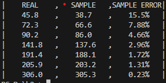
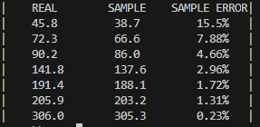
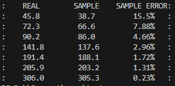

# PyTable  
A table for consoles, created with the aim of printing data in a table continuously throughout the day, without overflows or storage errors. 
Developed during a project to replace the PrettyTable library, which had memory errors during long laboratory experiments.  

# Usage  
Import the lib:
```python
from pytable import PyTable 
```
Setup the table:
```python
table = PyTable()
table.alignmentDigits = 12 # Digits per word
table.printHeader(['REAL', 'SAMPLE', 'SAMPLE ERROR'])  # Table variables/header
```

Printing data to the table: 
```python
table.addRow([1, 2, 3]) 
```



To change the divisor or the border of the table:
```python
table.divisor = ' ' # You can leave a space, a comma or whatever you want!
table.border = ' '
```


